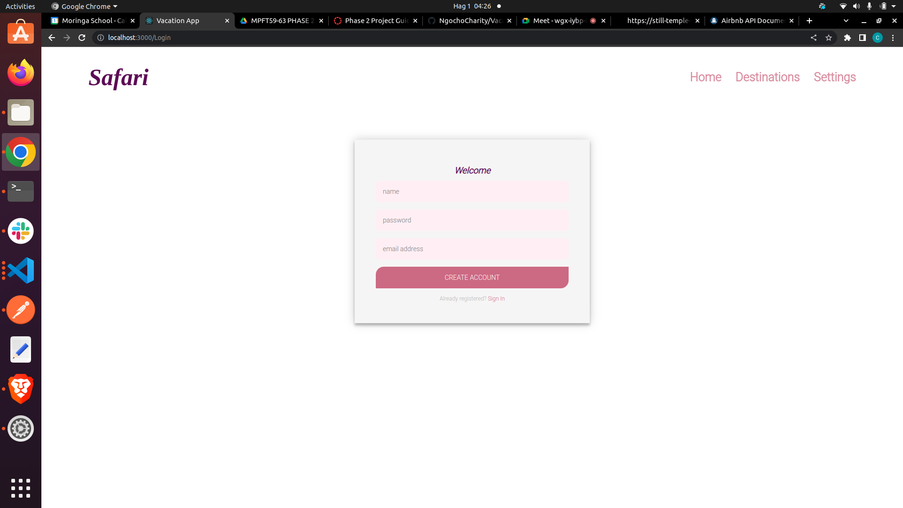

# Vacation App

# Design

### Login page

### Home page

### Destinations page

### Settings page

#### by Charity Ngocho.

### Description of the project.

## Table of Content 

+ [Description](#Description)
 
+ [Installation Requirement](#Installation)

+ [Technology Used](#technology-used)

+ [Reference](#reference)

+ [License](#license)

+ [Authors Info](authors-info)

+ [Live Link](live-link)

## Description

This is a Vacation Application that allows the user to view various destinations that they can go for their vacation.

## Installation Requirement

* Either a computer, phone, tablet or an ipad.
* Access to the internet.

## Technology Used 

* HTML - Used to buils the structure of the page.

* CSS - Used to style the page.

## Reference

* Canvas-LMS
* W3 schools

## License

MIT license
Copyright (c) [2019] [Charity Wanjiku]
Permission is hereby granted, free of charge, to any person obtaining a copy
of this software and associated documentation files (the "Software"), to deal
in the Software without restriction, including without limitation the rights
to use, copy, modify, merge, publish, distribute, sublicense, and/or sell
copies of the Software, and to permit persons to whom the Software is
furnished to do so, subject to the following conditions:

The above copyright notice and this permission notice shall be included in all
copies or substantial portions of the Software.

THE SOFTWARE IS PROVIDED "AS IS", WITHOUT WARRANTY OF ANY KIND, EXPRESS OR
IMPLIED, INCLUDING BUT NOT LIMITED TO THE WARRANTIES OF MERCHANTABILITY,
FITNESS FOR A PARTICULAR PURPOSE AND NONINFRINGEMENT. IN NO EVENT SHALL THE
AUTHORS OR COPYRIGHT HOLDERS BE LIABLE FOR ANY CLAIM, DAMAGES OR OTHER
LIABILITY, WHETHER IN AN ACTION OF CONTRACT, TORT OR OTHERWISE, ARISING FROM,
OUT OF OR IN CONNECTION WITH THE SOFTWARE OR THE USE OR OTHER DEALINGS IN THE
SOFTWARE.

## Authors Info

GitHub - [Charity Wanjiku](https://github.com/NgochoCharity)

## Live Link

LiveLink -[Gh-pages](https://ngochocharity.github.io/Week-2/)

